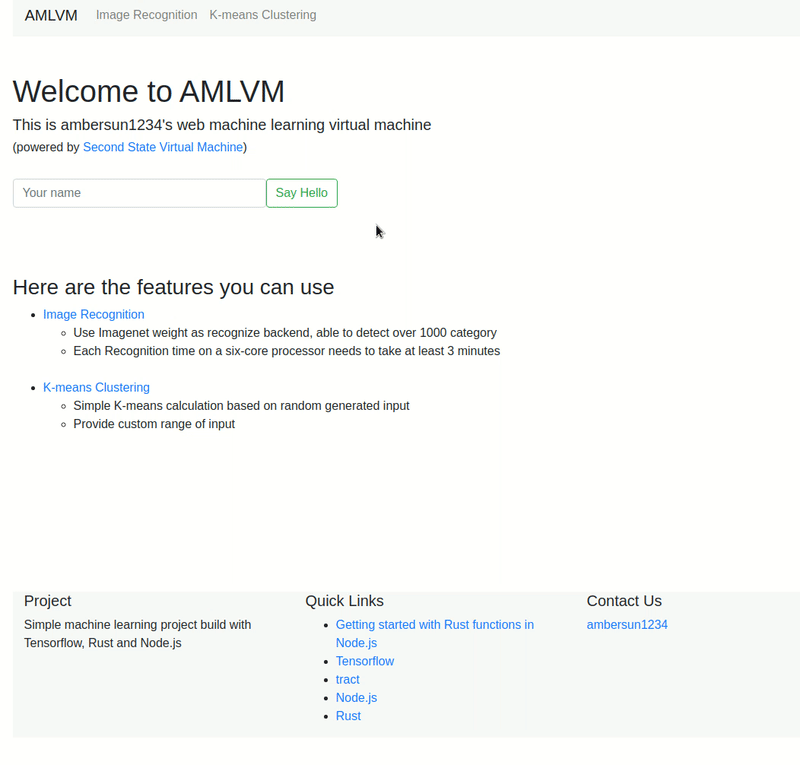

# AMLVM


Simple machine learning virtual machine


## Getting started
[Fork origin SSVM project](https://github.com/second-state/ssvm-nodejs-starter/fork) to create your own Rust functions in Node.js. [Learn more](https://www.secondstate.io/articles/getting-started-rust-nodejs-vscode/)

* The Rust functions are in the `src` directory. You can put high performance workload into Rust functions.
* The JavaScript functions are in the `node` directory and they can access the Rust functions.
* Use the `node node/app.js` command to run the application in Node.js.

## Use Docker to build and run

```
$ docker pull secondstate/ssvm-nodejs-starter:v1
# compile
$ make compile
# run node.js
$ make in
$ (docker) cd /app/node && node app.js
# stop server
$ make kill
```

## Website
+ Follow the above instructions to create docker instance
+ Visit `http://localhost:8080`

## Read more:
* [The Case for WebAssembly on the Server-side](https://www.secondstate.io/articles/why-webassembly-server/)
* [Guide on how to Rust and WebAssembly for server-side apps](https://www.secondstate.io/articles/getting-started-with-rust-function/)

## Resources
* [The Second State VM (SSVM)](https://github.com/second-state/ssvm) is a high performance [WebAssembly virtual machine](https://www.secondstate.io/ssvm/) designed for server-side applications.
* [The SSVM NPM addon](https://github.com/second-state/ssvm-napi) provides access to the SSVM, and programs in it, through a Node.js host application.
* [The SSVM ready tool, ssvmup](https://github.com/second-state/ssvmup) is a [toolchain](https://www.secondstate.io/articles/ssvmup/) for compiling Rust programs into WebAssembly, and then make them accessible from JavaScripts via the SSVM.
+ [Rust - Borrowing](https://askeing.github.io/rust-book/references-and-borrowing.html)
+ [Rust - Ownership and moves](https://doc.rust-lang.org/rust-by-example/scope/move.html#ownership-and-moves)
+ [Rust - Understanding Rust: ownership, borrowing, lifetimes
](https://medium.com/@bugaevc/understanding-rust-ownership-borrowing-lifetimes-ff9ee9f79a9c)

Brought to you by the Open source dev team at [Second State](https://www.secondstate.io/). Follow us on [Twitter](https://twitter.com/secondstateinc), [Facebook](https://www.facebook.com/SecondState.io/), [LinkedIn](https://www.linkedin.com/company/second-state/), [YouTube](https://www.youtube.com/channel/UCePMT5duHcIbJlwJRSOPDMQ), or [Medium](https://medium.com/wasm)
